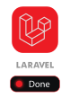
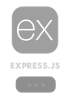

# 👋 Let me introduce myself: Ashkan

**Full‑stack developer** committed to delivering secure, scalable, and user‑friendly web applications. Skilled in **Laravel 12**, **PHP**, modern frontend technologies, and database management. Adept at building clean, maintainable codebases and improving application performance. Open to collaboration on challenging projects and dedicated to delivering value‑driven solutions. 🚀

## 📝 About Me

With a strong focus on web security and development best practices, I design systems that balance functionality, performance, and maintainability. My workflow emphasizes clear communication, efficient problem‑solving, and consistent delivery. I’m passionate about learning new technologies and contributing to high‑impact projects.

## 💻 Skills

*   **Backend:** Laravel 12, PHP
*   **Frontend:** HTML, CSS, JavaScript, Tailwind CSS
*   **Security:** Authentication workflows, OAuth, Data encryption
*   **Databases:** MySQL, MariaDB
*   **Tools:** Git, CI/CD pipelines, Laragon local server

## 🚀 Featured Projects

### MVP Content Platform

A secure platform for content sharing with:

*   High-security authentication (token-rotation to prevent breaches)
*   User login via Google or phone number
*   Q&A system for community interaction
*   ajax search(articles - projects - tags - categories - ...)
*   mega menu and other styles you can change
*   exper user panel (likes - bookmarks - converations - vots - user info - ajax change phone - sessions management)
*   q&a (set best answer - can add privet q for ticket by mentioned persons)
*   edit article (expert and custom editor.js with markdown)
*   builder (for page building with ready template) -- in development
*   modular system for better devlopment . 
*   modules developed (content - activity log - user )
*   modules for develop (q&a - rule/permission - markable - comment - projects - booking - shop - vip users - LMS)

**Live Demo:** [mvp(my web site for test and development)](https://bigstack.ir/)

### Other Projects deployed

*   [Dental site](https://mohabatmousaee.ir/) – Short description.

## 📫 Let’s Connect

*   Blog/Portfolio: [bigstack](https://bigstack.ir/)

Thanks for visiting! If you have ideas for my MVP or want to collaborate, open an issue or DM me. 😊

